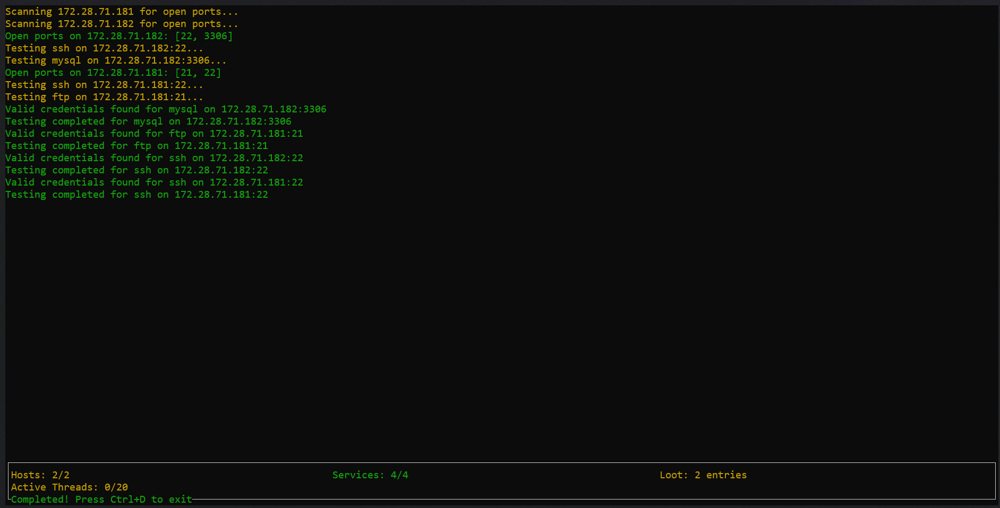

# Bruteforce-Automation-Script

This tool is designed to test various network services for weak or default credentials by performing brute-force attacks using `hydra` and `nmap` for open port discovery. It supports multiple services such as SSH, FTP, RDP, MySQL, and others, providing a progress display along with logging of discovered credentials.

## Features

- **Open Port Discovery**: Uses `nmap` to detect open ports for specified services on a target.
- **Brute Force Testing**: Uses `hydra` to perform brute-force attacks on services like SSH, FTP, RDP, MySQL, and more.
- **Multithreading**: Supports parallel testing of services with `ThreadPoolExecutor` for improved performance.
- **Progress Reporting**: Provides real-time progress updates in a terminal window using `curses`.
- **Logging**: Logs output and discovered credentials into a `logs/` directory to keep track of successful attempts.
- **Customizable**: Allows adjusting the number of concurrent threads, services to be tested, and wordlists for credential testing.

### pending Stuff :warning:
1. **conver loot to json** - for easy parsing and analysis.
2. **logging namp out put** - for easy analysis and reporting.
3. **log file that says no creditneial found for a host** - for easy analysis and reporting.
4. **kill a halted task after a time** - so the script is not stuck on a single host for a long time.
5. **use proper wordlsits** - for better results and less time spent on brute-forcing.



## Requirements

To run this tool, you need the following dependencies installed:

1. **nmap** – For discovering open ports on the target.
2. **hydra** – For brute-forcing login credentials on supported services.
3. **Python 3.x** – The scripting language for running the tool.
4. **Curses Library** – For terminal-based progress display (available in most Python distributions).


### Installation

1. Install `nmap` and `hydra` on your system.

    On Ubuntu:
    ```bash
    sudo apt-get install nmap hydra
    ```

2. Clone the repository:
    ```bash
    git clone https://github.com/neerajlovecyber/Bruteforce-Script.git
    cd Bruteforce-Script
    ```

3. Create a `targets.txt` file in the current directory, with each IP address on a new line.

4. Run the tool:
    ```bash
    python3 auto_brute.py
    ```

## Configuration

You can customize the following settings by modifying the variables at the top of the script:

- `max_concurrent_hosts`: The maximum number of concurrent hosts to scan/test.
- `service_parallelism_enabled`: Set to `True` to enable parallel testing of services; `False` for sequential testing.
- `threads`: The number of threads to use for `hydra` brute-forcing.
- `user_password_files`: The wordlists for usernames and passwords for each supported service.

## Usage

### Running the Tool

1. **Target Hosts**: Specify the IP addresses of the target hosts in a text file `targets.txt`.
   
2. **Start Testing**: The script will scan each target for open ports using `nmap` and then attempt brute-forcing on the open services using `hydra`. The progress and log output will be displayed in the terminal window.

3. **View Results**: The discovered credentials are saved in the `logs/` directory, and the real-time progress will be displayed in the terminal. The loot will be available in `loot.txt`.

    Example Output:
    ```bash
    === Security Test Results - Started at 2024-11-26 21:24:27.090076 ===

    === Found at 2024-11-26 21:27:29.116072 ===
    Target: 172.28.71.182
    Credentials found:
    [3306][mysql] host: 172.28.71.182   login: admin   password: admin
    ========================================

    === Found at 2024-11-26 21:27:29.116099 ===
    Target: 172.28.71.181
    Credentials found:
    [22][ssh] host: 172.28.71.181   login: admin   password: admin123
    ========================================
    ```

### Commands

- **Open Port Discovery**: The tool automatically scans for open ports before performing brute-force testing.
- **Brute Force Testing**: The tool will use the specified username and password wordlists to attempt login via the supported services.
- **Logging**: All activity and discovered credentials are saved to the `logs/` directory.


